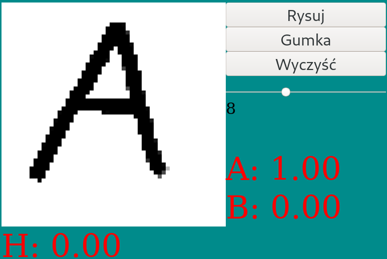

# Node-Python Character recognition 

Simple web app which allows to detect single character based on its image. Classifier was trained in june 2018 based on dataset provided for University classes (EMNIST based dataset). Classifier was trained using Tensorflow and rewritten to pure NumPy.

Dependencies:
- [Express](https://expressjs.com/) - web server
- [NumPy](https://numpy.org/) - math

